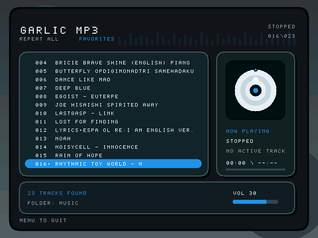

# Garlic MP3 Player

Minimal MP3 player for the original Anbernic RG35XX / RG35XX OG running GarlicOS 1.4.9.



- Standalone GarlicOS APPS launcher.
- SDL 1.2 UI and joystick input, patched specifically for RG35XX hardware.
- MP3 playback through a bundled static `mpg123` subprocess.
- Music scan from `Roms/MUSIC` (SD2), `Roms/APPS/GarlicMP3/MUSIC`, or `/mnt/mmc/MUSIC`.
- Folder-sorted library with one-level subdirectory scanning.
- ID3v2/ID3v1 title and artist display, with cleaned filename fallback.
- Repeat off/all/one, shuffle, pause/resume, previous/next track, and volume control.
- Favorites with favorites-only playback mode, saved in `favorites.cfg` beside the app.
- Recent track navigation saved in `recent.cfg`.
- Resume state saved in `state.cfg`, including selected track, active track, elapsed time, repeat mode, favorites-only mode, debug flag, and volume.
- Optional startup defaults through `config.cfg`.
- No GarlicOS 2, MuOS, Knulli, RG35XX Plus/H/2024, or H700 assumptions.

## Build (recommended)

Requires Docker.

```sh
make docker-rg35xx-dist
```

This uses `toolchain/` — a custom Docker image based on `nfriedly/miyoo-toolchain:steward`
with SDL 1.2.15 recompiled from source with RG35XX-specific patches:

- Removes `TIOCNOTTY` call in fbcon keyboard driver (fixes input on GarlicOS).
- Fixes joystick detection for hat-only devices (RG35XX D-pad).
- Adds vsync and triple-buffer support for the Actions SoC framebuffer.

The toolchain image is built automatically on first run from `toolchain/Dockerfile`.
Subsequent runs skip the build step.

Output:

```text
dist/APPS/
  GarlicMP3.sh
  GarlicMP3/
    garlic-mp3-player
    mpg123
    assets/            # optional, for background.bmp
    MUSIC/
    README.txt
```

## Install

Copy `dist/APPS/` contents to the ROMS partition:

```text
SD2:/Roms/APPS/GarlicMP3.sh
SD2:/Roms/APPS/GarlicMP3/garlic-mp3-player
SD2:/Roms/APPS/GarlicMP3/mpg123
SD2:/Roms/APPS/GarlicMP3/MUSIC/
```

Put MP3 files in any of:

```text
SD2:/Roms/MUSIC/
SD2:/Roms/APPS/GarlicMP3/MUSIC/
SD1:/mnt/mmc/MUSIC/
```

The app scans one subdirectory level below those folders.

## Optional Background Image

The UI can load a custom 640x480 BMP without extra libraries:

```text
SD2:/Roms/APPS/GarlicMP3/assets/background.bmp
```

Use uncompressed BMP. PNG/JPG are intentionally not supported yet to keep the
GarlicOS build simple.

## Controls

| Button | Action |
|--------|--------|
| D-pad Up/Down | Select track |
| D-pad Left/Right | Previous / Next track |
| A | Play selected |
| B | Stop |
| X | Pause / Resume |
| Y | Toggle favorite |
| L / L2 | Volume down |
| R | Volume up |
| SELECT | Toggle repeat mode |
| SELECT + Y | Toggle favorites-only mode |
| SELECT + D-pad Up/Down | Previous / next folder |
| SELECT + D-pad Left/Right | Previous / next recent track |
| START | Shuffle play |
| MENU | Quit |

When favorites-only mode is enabled, list navigation and auto-advance skip
non-favorite tracks. `START` shuffles favorites when favorites-only mode is on or
when the selected track is a favorite; otherwise it shuffles all tracks.

## Optional Config

Create `Roms/APPS/GarlicMP3/config.cfg` to override startup defaults:

```text
repeat_mode=1
favorites_only=0
debug=0
volume_step=5
```

Runtime state is still saved in `state.cfg`, so the most recent app state takes
priority after the first run.

## Troubleshooting

- **App does not appear in launcher**: verify `GarlicMP3.sh` is directly under `Roms/APPS/` and is executable.
- **App launches then returns immediately**: check `Roms/APPS/GarlicMP3/garlic-mp3.log`.
- **UI opens but no sound**: verify `mpg123` exists in the app folder and is executable.
- **No MP3 files shown**: only `.mp3` files are scanned; check music folder paths above.
- **Track names look wrong**: the app uses ID3v2/ID3v1 title and artist when available; otherwise it cleans up the filename.
- **Volume does not change**: the app writes `/sys/class/volume/value`; check `garlic-mp3.log` for `volume=` output.
- **Controls wrong**: press the button and check `garlic-mp3.log` for `JOY unknown btn=X`, then update `src/input.c`.

## Alternative Build: Miyoo Toolchain (legacy)

Produces a fully static binary. Input does not work reliably due to SDL not being
patched for RG35XX. Kept for reference only.

```sh
make docker-miyoo-dist
```

## Alternative Build: garlic.img sysroot

If `garlic.img` is present in the repo root, the GarlicOS SDL can be extracted and
linked against directly:

```sh
make extract-garlic-sysroot
make garlic-img-dist
```

Requires `7z` and `arm-linux-gnueabihf-gcc`. The resulting binary needs glibc ≤ 2.32
on the device (matches Drastic's bundled `libc.so.6`).

## Log File

Runtime log is written to:

```text
Roms/APPS/GarlicMP3/garlic-mp3.log
```
