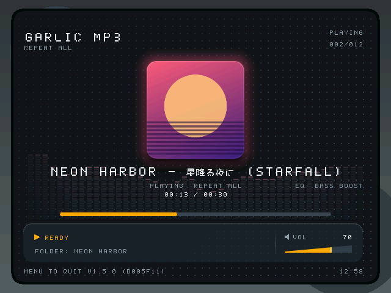
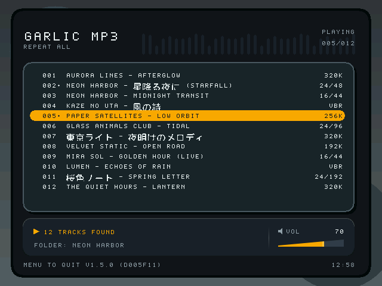
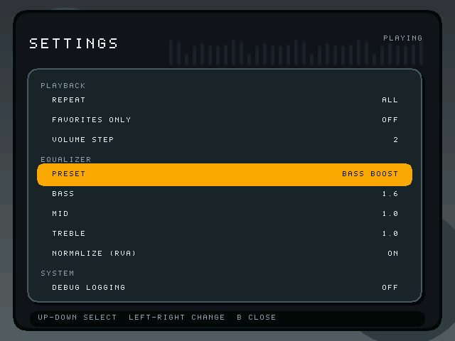
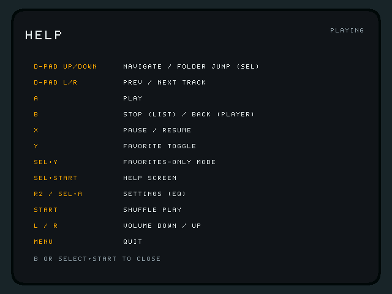

# Garlic MP3 Player

MP3 + lossless FLAC music player for the original Anbernic RG35XX / RG35XX OG
running GarlicOS 1.4.9.



| Library | Settings | Help |
|---|---|---|
|  |  |  |

## Features

**Playback**
- MP3 through a single persistent `mpg123 -R` process: gapless track changes,
  clean pause/resume, accurate elapsed/duration (VBR included) and precise resume.
- FLAC on its own path (dr_flac decoder + `out123`), separate from MP3, so a
  FLAC problem never breaks MP3 playback.
  - 16-bit FLAC reaches the output **bit-exact** when EQ is Flat and RVA is off.
  - 24-bit FLAC, or any FLAC with EQ/ReplayGain, goes through a fixed-point
    stage and is TPDF-dithered to 16-bit.
  - Gapless between consecutive tracks with the same format.
- 3-band equalizer (bass/mid/treble) with presets (Flat, Bass Boost,
  Bass+Treble, Vocal, Rock, Custom) and automatic anti-clipping headroom, for
  both MP3 and FLAC.
- ReplayGain normalization (RVA): MP3 via mpg123 `RVA mix`, FLAC via
  `REPLAYGAIN_TRACK_GAIN` / `REPLAYGAIN_TRACK_PEAK`.
- Repeat off/all/one, shuffle, previous/next, favorites and favorites-only
  mode, recent-track navigation, volume control.

**Now playing**
- Cover art from the file (MP3 APIC / FLAC PICTURE), or `cover.jpg`,
  `folder.jpg`, `front.jpg` (or `.png`) next to the track, shown as a rounded
  card with a soft shadow and a glow tinted by the cover.
- Spectrum visualizer driven by the actual music: each track is analyzed once
  (on first play, then the rest of the library in the background at low
  priority) and cached under `cache/`.

**Library**
- Scans `Roms/MUSIC` (SD2), `Roms/APPS/GarlicMP3/MUSIC`, or `/mnt/mmc/MUSIC`,
  plus one subdirectory level; folder-sorted.
- Titles/artists from ID3v2/ID3v1 (MP3) or Vorbis comments (FLAC), with a
  cleaned filename fallback; Japanese titles render with a built-in CJK font.
- The list shows the bitrate for MP3 (`320K`, `VBR`) and bit depth / kHz for
  FLAC (`16/44`, `24/96`).

**App**
- Standalone GarlicOS APPS launcher; SDL 1.2 UI and joystick input patched
  specifically for RG35XX hardware.
- Settings screen (R2 or Select+A): changes apply live and persist.
- Resume state in `state.cfg`; optional startup defaults in `config.cfg`.
- No GarlicOS 2, MuOS, Knulli, RG35XX Plus/H/2024, or H700 assumptions.

## Install

1. Download `GarlicMP3-vX.Y.Z-rg35xx.zip` from the
   [Releases](https://github.com/iqbaladinur/garlicmp3/releases) page (or build
   it, see below) and extract it.
2. Copy the contents of `APPS/` to the ROMS partition:

   ```text
   SD2:/Roms/APPS/GarlicMP3.sh
   SD2:/Roms/APPS/GarlicMP3/garlic-mp3-player
   SD2:/Roms/APPS/GarlicMP3/mpg123
   SD2:/Roms/APPS/GarlicMP3/out123
   SD2:/Roms/APPS/GarlicMP3/MUSIC/
   ```

3. Put `.mp3` / `.flac` files in any of:

   ```text
   SD2:/Roms/MUSIC/
   SD2:/Roms/APPS/GarlicMP3/MUSIC/
   SD1:/mnt/mmc/MUSIC/
   ```

## Controls

| Button | Action |
|--------|--------|
| D-pad Up/Down | Select track (hold to repeat) |
| D-pad Left/Right | Previous / next track |
| A | Play selected track and open Now Playing |
| B | Stop (in the list) / back to the list, music keeps playing (in Now Playing) |
| X | Pause / resume |
| Y | Toggle favorite |
| L / R | Volume down / up |
| START | Shuffle play |
| SELECT (tap) | Cycle repeat mode |
| SELECT + D-pad Up/Down | Previous / next folder |
| SELECT + D-pad Left/Right | Previous / next recent track |
| SELECT + X, or L2 | Toggle list / Now Playing view |
| SELECT + Y | Toggle favorites-only mode |
| SELECT + A, or R2 | Settings (EQ, RVA, ...) |
| SELECT + START | Help screen |
| MENU | Quit |

In Settings: Up/Down selects, Left/Right changes, B closes.

When favorites-only mode is enabled, list navigation and auto-advance skip
non-favorite tracks. `START` shuffles favorites when favorites-only mode is on or
when the selected track is a favorite; otherwise it shuffles all tracks.

## Optional Config

Create `Roms/APPS/GarlicMP3/config.cfg` to override startup defaults:

```text
repeat_mode=1            # 0 off, 1 all, 2 one
favorites_only=0
debug=0                  # 1 = verbose input/heartbeat lines in the log
volume_step=2            # 1..20
eq_preset=0              # 0 Flat, 1 Bass Boost, 2 Bass+Treble, 3 Vocal, 4 Rock, 5 Custom
eq_bass=10               # Custom only, tenths (10 = 1.0x)
eq_mid=10
eq_treble=10
rva=0                    # ReplayGain normalization
spectrum_background=1
spectrum_latency_ms=150
```

- `spectrum_background`: `1` analyzes the rest of the library in the background
  (low priority, duty-cycled, pauses for 3 s after any button press); `0` only
  analyzes tracks as they are played.
- `spectrum_latency_ms`: shifts the MP3 visualizer back by this many
  milliseconds to match the audio output buffer. Raise it if the bars move
  before the sound, lower it if they lag behind.

Runtime state is saved in `state.cfg`, so the most recent app state takes
priority after the first run. For a bit-exact FLAC path, keep EQ on Flat and RVA
off; `garlic-mp3.log` shows `bit-exact` or `TPDF dither` for each FLAC track.

## Build (recommended)

Requires Docker.

```sh
make docker-rg35xx-dist
```

This uses `toolchain/` — a custom Docker image based on `nfriedly/miyoo-toolchain:steward`
with SDL 1.2.15 recompiled from source with RG35XX-specific patches:

- Removes `TIOCNOTTY` call in fbcon keyboard driver (fixes input on GarlicOS).
- Fixes joystick detection for hat-only devices (RG35XX D-pad).
- Adds vsync and triple-buffer support for the Actions SoC framebuffer.

The toolchain image is built automatically on first run from `toolchain/Dockerfile`.
Subsequent runs skip the build step.

Output:

```text
dist/APPS/
  GarlicMP3.sh
  GarlicMP3/
    garlic-mp3-player
    mpg123
    out123             # FLAC output (from the mpg123 package)
    assets/            # optional, for background.bmp
    MUSIC/
    README.txt
```

Without Docker (static ARM build with zig, also used for the release zips):
see [AGENTS.md §5.2](AGENTS.md#52-without-docker-eg-cloud-sandbox-where-docker-hub-is-blocked).
Development, testing and architecture notes are in [AGENTS.md](AGENTS.md).

## Optional Background Image

The UI can load a custom 640x480 BMP without extra libraries:

```text
SD2:/Roms/APPS/GarlicMP3/assets/background.bmp
```

Use uncompressed BMP. PNG/JPG are intentionally not supported for the
background to keep the GarlicOS build simple.

Note the main UI panel covers nearly the whole screen, so the background is
only visible as a thin colored border/glow around the edges and corners —
by design, not a bug.

### Bundled theme backgrounds

`assets/themes/` ships five ready-made 640x480 BMPs. Pick one and copy it to
`assets/background.bmp` (renaming it) to use it:

| Theme | Look |
|-------|------|
| `sunset.bmp` | warm orange-to-pink gradient |
| `ocean.bmp` | cool teal-to-blue gradient |
| `forest.bmp` | dark green with amber accents |
| `midnight.bmp` | neutral dark navy/indigo (closest to the built-in default) |
| `synthwave.bmp` | deep purple-to-magenta |

```sh
cp assets/themes/ocean.bmp assets/background.bmp
```

## Troubleshooting

- **App does not appear in launcher**: verify `GarlicMP3.sh` is directly under `Roms/APPS/` and is executable.
- **App launches then returns immediately**: check `Roms/APPS/GarlicMP3/garlic-mp3.log`.
- **UI opens but no sound**: verify `mpg123` exists in the app folder and is executable.
- **No tracks shown**: only `.mp3` and `.flac` files are scanned; check music folder paths above.
- **FLAC shows "out123 not found" / "audio output stopped"**: copy `out123` next to
  `mpg123` in the app folder; "audio output stopped" means out123 could not open
  or lost the audio device (see `garlic-mp3.log`). MP3 playback is unaffected.
- **FLAC limits**: mono/stereo only; output is 16-bit.
- **Track names look wrong**: the app uses ID3v2/ID3v1 (MP3) or Vorbis comment (FLAC) title and artist when available; otherwise it cleans up the filename.
- **No cover art**: embed a cover in the file, or put `cover.jpg` / `folder.jpg` / `front.jpg` (or `.png`) next to the tracks.
- **Volume does not change**: the app writes `/sys/class/volume/value`; check `garlic-mp3.log` for `volume=` output.
- **Spectrum bars look synthetic / not following the music**: the track is still
  being analyzed (a few seconds on first play) or could not be decoded. Analysis
  results live in `Roms/APPS/GarlicMP3/cache/*.spc` (about 36 KB per minute of
  audio); deleting that folder is safe and forces re-analysis.
- **Controls wrong**: set `debug=1`, press the button and check `garlic-mp3.log` for `JOY unknown btn=X`, then update `src/input.c`.

## Alternative Build: Miyoo Toolchain (legacy)

Produces a fully static binary. Input does not work reliably due to SDL not being
patched for RG35XX. Kept for reference only.

```sh
make docker-miyoo-dist
```

## Alternative Build: garlic.img sysroot

If `garlic.img` is present in the repo root, the GarlicOS SDL can be extracted and
linked against directly:

```sh
make extract-garlic-sysroot
make garlic-img-dist
```

Requires `7z` and `arm-linux-gnueabihf-gcc`. The resulting binary needs glibc ≤ 2.32
on the device (matches Drastic's bundled `libc.so.6`).

## Log File

Runtime log is written to:

```text
Roms/APPS/GarlicMP3/garlic-mp3.log
```
